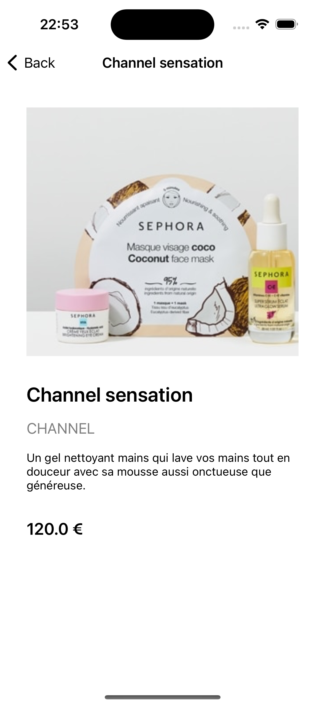

# Sephora iOS


## Overview

A showcase for Sephora products that fetches product data from a network service, caches it locally using Core Data, and handles errors effectively.

## Features

- Asynchronous data fetching
- Local caching with Core Data
- Error handling


## Screenshots

   


## Architecture

The project follows the MVVM+C (Model-View-ViewModel-Coordinator) architecture.

- **Model**: Represents the data layer (e.g., `ProductItem`, `Brand`, `ImagesUrl`).
- **View**: UI components (e.g., `ErrorView`, `ProductCollectionViewCell`).
- **ViewModel**: Manages the presentation logic (e.g., `ProductViewModel`).
- **Coordinator**: Handles navigation flow.

## Design Patterns

- **Repository Pattern**: Used to abstract the data layer and provide a clean API for data access.
  - `SephoraRepository`: Handles data operations and local caching.
  - `SephoraRepositoryProtocol`: Defines the repository interface.

- **Singleton Pattern**: Ensures a single instance of a class.
  - `CacheLayer`: Manages Core Data stack as a singleton.
  - `CacheLayerProtocol`: Defines the cache layer interface.

- **Actor Model**: Used for safe concurrent access.
  - `SephoraNetworkService`: Fetches data from network.
  - `SephoraService`: Combines network and repository services.

- **Protocol-Oriented Programming**: Defines clear interfaces.
  - `SephoraNetworkServiceProtocol`: Interface for network service.
  - `SephoraServiceProtocol`: Interface for service layer.
  - 
 ## Modules

- **SephoraBusiness**: Contains all the business logic.
- **Components**: Includes all the UI components.
- **Entities**: Defines the data contracts between the views and the business logic.

## Prerequisites

- Xcode 15 or later
- Swift 5.9 or later
- iOS 16 or later
- Core Data framework

## Installation

1. Clone the repository:
   ```
   git clone https://github.com/bokri/sephora-ios-app.git
   ```

2. Open in Xcode:
   ```
   open Sephora.xcodeproj
   ```

3. Build and run the project.

## Unit Tests

Unit tests are provided to ensure the reliability and correctness of the business logic. Each module contains its own set of unit tests.

- **SephoraBusiness Tests**: Tests the core business logic and data manipulation.
- **Components Tests**: Tests the UI components and their interactions.
- **Entities Tests**: Tests the data models and their conversions.
- **App Tests**: Tests the overall integration and coordination within the app.

## Dependencies

### RxSwift

RxSwift is a reactive programming library for Swift. It is used to manage asynchronous data streams and events, enabling the creation of reactive and responsive applications.
For issues and support, please check out the main repository: [RxSwift](https://github.com/ReactiveX/RxSwift)

### XCStrings Tool (Plugin)

A plugin to generate Swift constants for your String Catalogs.
For issues and support, please check out the main repository: [XCStrings Tool](https://github.com/liamnichols/xcstrings-tool)

> **Note:** This tool is used only in development.

### OHHTTPStubs

OHHTTPStubs is a testing library designed to stub network requests. It allows you to simulate responses from a server to test how your app handles various scenarios like error responses, slow networks, or specific data payloads without actually performing the network request.
For issues and support, please check out the main repository: [OHHTTPStubs](https://github.com/AliSoftware/OHHTTPStubs).

> **Note:** This tool is used only in unit tests.


## License

MIT License - see [LICENSE](LICENSE.md) for details.

## Contact

For inquiries, email [aymen.bokri16@gmail.com](mailto:aymen.bokri16@gmail.com).

---

_© 2024 Sephora_